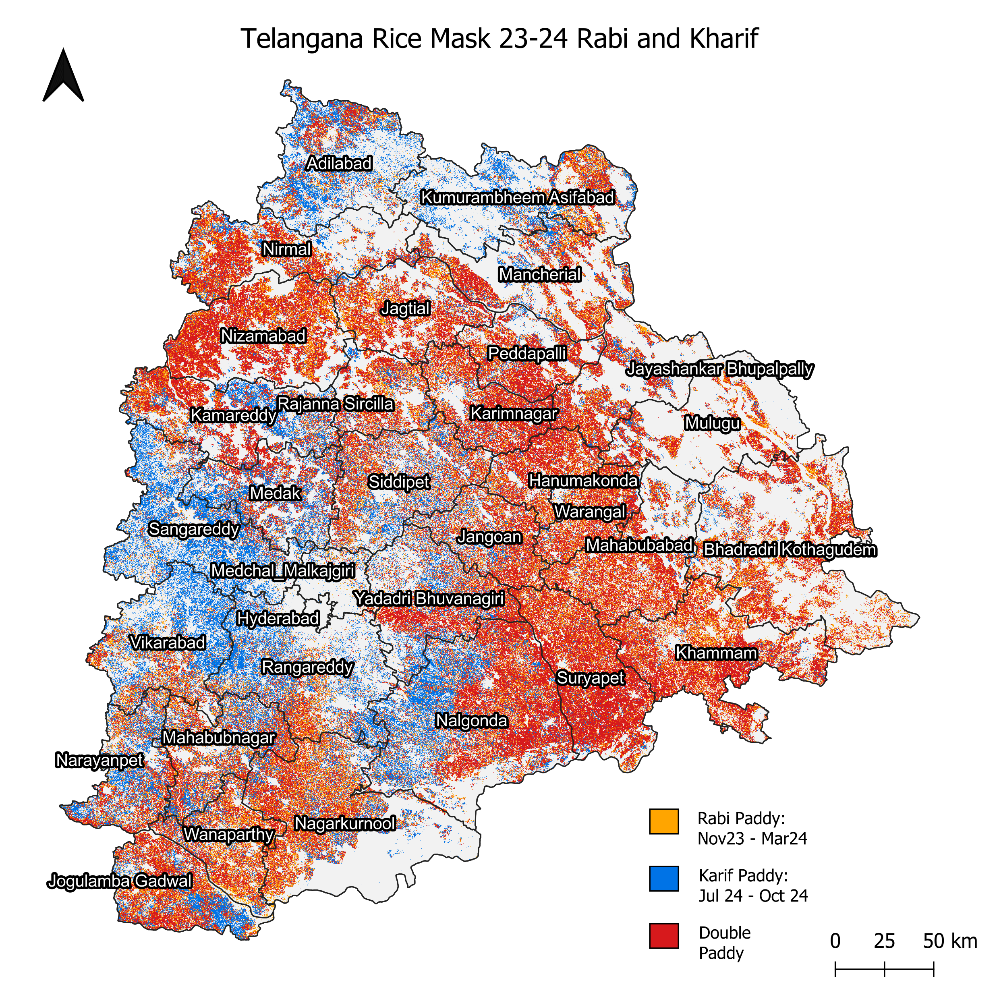
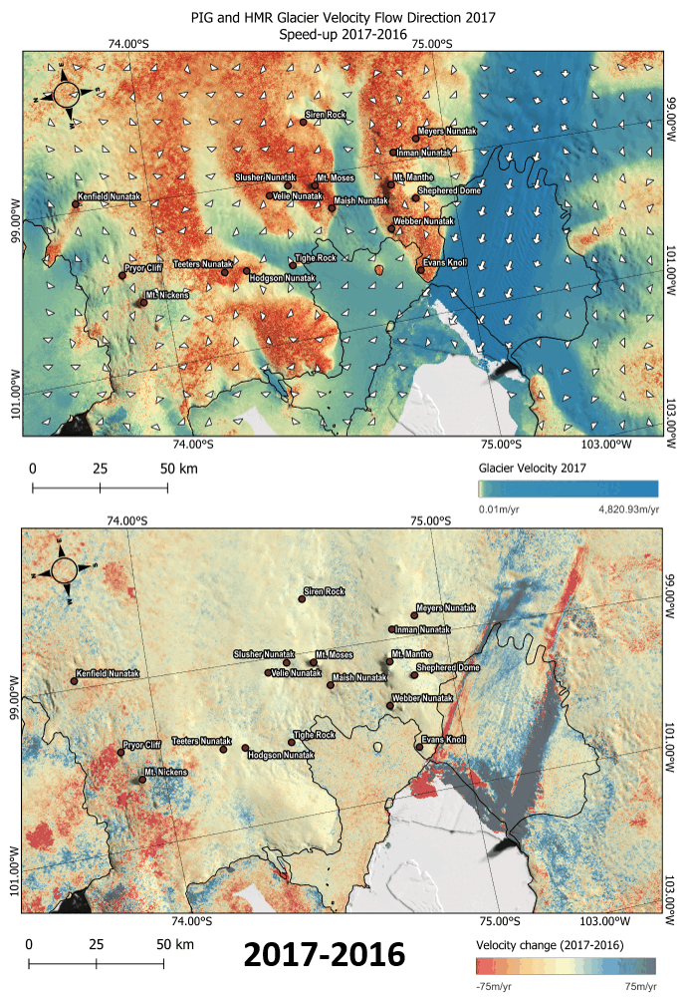
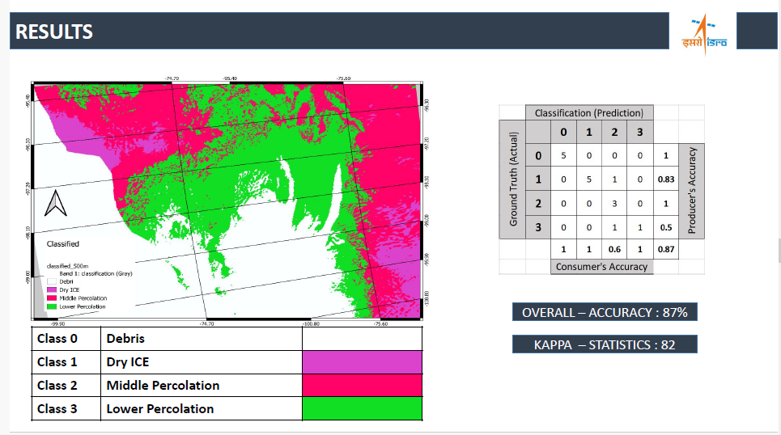
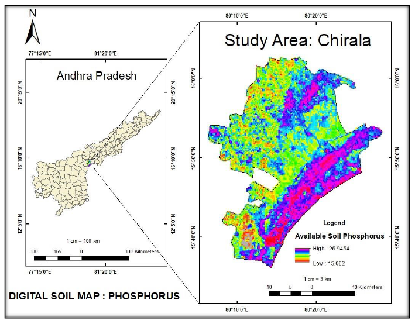
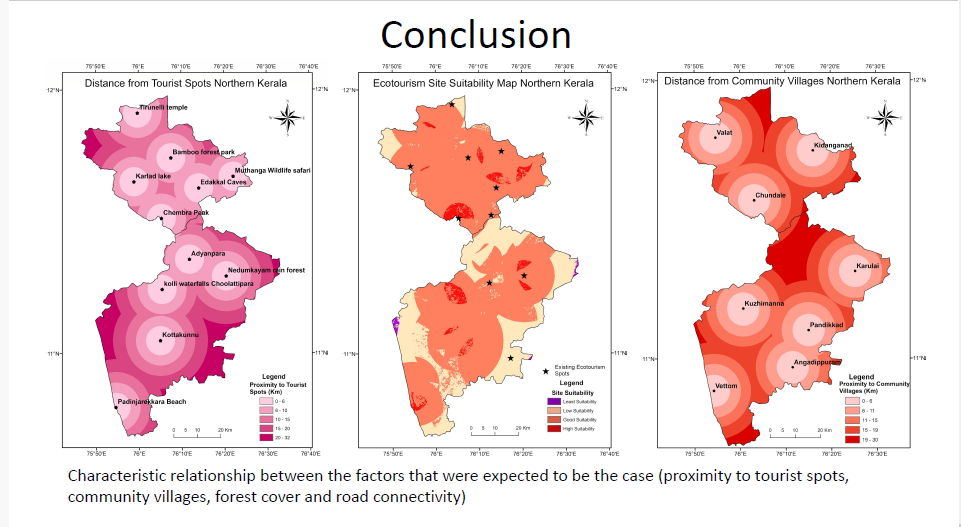

# Example-work-Draft
Just to showcase some of my work It will be improved over time.

## Some results of my work at Mitti-Labs (Random Forest)

___

## Spatiotemporal anomaly detection and visualization of Pine Island Glacier, Antarctica. (M. Tech thesis)

This is one such derived map of glacier speed-up of the region mapped using QGIS, the image shows the yearly change of velocity across the PIG, The work is still in publication process. more can be discussed if and when requested.

___
## Glacier facies classification using SAR - backscatter and glacier velocity mapping of Pine Island Glacier. (Case study)
### PPTX (Original)
[Download PPTX]([slides/presentation.pptx](https://docs.google.com/presentation/d/1a1qWEanfW2ggZRPkSSBu0mVdv5J6exZ1/edit?usp=sharing&ouid=113016786903665385533&rtpof=true&sd=true))

### Preview

___
## Digital soil mapping (Phosphorus and Zinc) for the Chirala, municipality, Andhra Pradesh using multiple linear regression. (Team Project: 3 members).

### Preview

___
## Role of GIS in determining potential ecotourism sites in Malappuram and Wayanad districts Northern Kerala. (Team Project: 4 members).

### Preview

___
## Workflow to curate and decimate flooding-related data products and impact assessment (Team Project: 4 members).

### Preview

___
